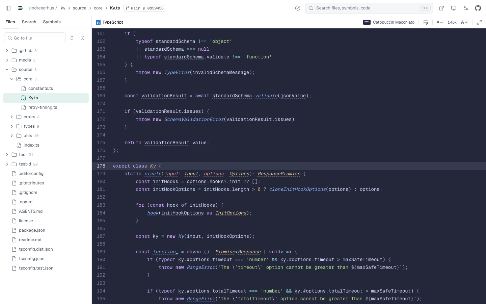

<p align="center">
  
</p>

<h1 align="center">CoderImpact</h1>

<p align="center"><strong>Lightweight IDE in your browser</strong><br>For humans who want to understand code</p>

<p align="center"><a href="https://coderimpact.com">coderimpact.com</a></p>

Coding agents write most of the code now. CoderImpact is for reading and steering it: open a public GitHub repository or a folder on your computer in the browser, with IntelliSense and AI explanations. No installation, no login. It is built for understanding, and lets you make small edits in local folders, but it is not a replacement for your full IDE.

<p align="center"></p>

## What it does

- **IntelliSense for 15 languages:** go to definition, find usages and callers in Go, PHP, TypeScript, JavaScript, Python, Java, C#, Kotlin, Scala, Ruby, Elixir, Rust, C and C++.
- **AI explanations, only when you ask:** a short explanation of a line, a selection, a function or a class, shown right below the code, written for the languages you already know.
- **Privacy first:** GitHub repositories and folders on your computer are read and indexed in your browser. Local files are never uploaded; code goes to the AI only after you agree.
- **Quick edits in local folders:** fix something while you read. Edit a file with completion for class members, rename a class, function or variable across files, save with ⌘S (Chrome and Edge). Made for exploring and understanding code, not a replacement for your full IDE.
- **Nothing to install, no login:** paste `owner/repo` or a GitHub link, or drop a folder. Installable as an app (PWA).

## Run it locally

Requires Node.js 22 or newer.

```bash
npm install
npm run dev        # http://localhost:5173
```

That is all for reading and navigating code. For AI explanations, put an [OpenRouter](https://openrouter.ai) key in `.env`:

```bash
cp .env.example .env   # then set OPENROUTER_API_KEY
```

`npm test` runs the test suite, `npm run build` builds the static site into `dist/`. The site deploys to Cloudflare Pages with the backend in `functions/` (a Git pass-through and the explanation relay).

## Author

Built by [Fabian Wesner](https://www.linkedin.com/in/fabian-wesner/), Tecsteps GmbH.

## License

[MIT](LICENSE)
